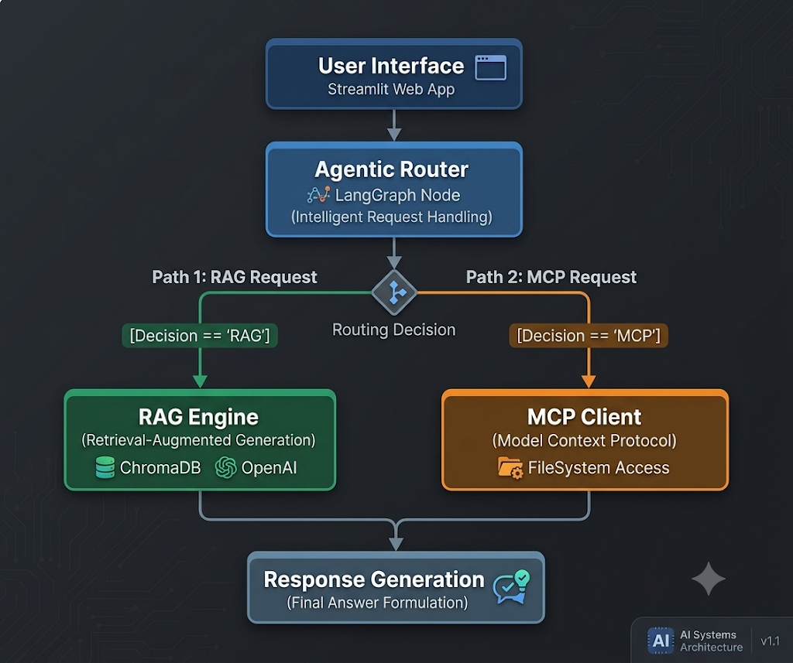

# 🧶 Ariadne : Assistant Onboarding Développeur (LangGraph + RAG + MCP)

**Ariadne** est un assistant IA autonome conçu pour accélérer l'onboarding des développeurs sur un nouveau projet. Il combine la recherche dans la documentation d'entreprise (via **RAG**) et l'inspection en temps réel du code source local (via **MCP**), orchestré par un routeur agentique **LangGraph**.

> 💡 Fini de jongler entre la doc Confluence et la lecture manuelle du code : Ariadne route intelligemment chaque question vers la bonne source d'information.

---

## 📸 Aperçu



> **Note sur le design / UI :** Le style visuel et l'interface Streamlit ont été générés avec l'aide de l'IA pour gagner du temps et se concentrer à 100 % sur l'architecture backend, le routage LangGraph et l'intégration MCP.

---

## 🏗️ Architecture Technique

Ariadne repose sur un **routeur agentique** qui décide dynamiquement, pour chaque requête utilisateur, quelle source d'information consulter :

| Composant | Rôle |
|---|---|
| **User Interface** | Interface web Streamlit pour dialoguer avec l'assistant |
| **Agentic Router** | Nœud LangGraph qui analyse l'intention et route la requête |
| **RAG Engine** | Recherche sémantique dans la documentation (ChromaDB + OpenAI Embeddings) |
| **MCP Client** | Accès direct au système de fichiers du projet cible (Model Context Protocol) |
| **Response Generation** | Formulation de la réponse finale à partir du contexte récupéré |

**Stack technique :**
- **LangGraph** : orchestration du flux de décision et routage conditionnel
- **RAG Engine** : ingestion Markdown, découpage sémantique (`RecursiveCharacterTextSplitter`), stockage vectoriel (`ChromaDB`), embeddings OpenAI
- **MCP Client** : interaction directe avec le système de fichiers (lecture d'arborescence et de fichiers source)
- **Pydantic** : structuration rigoureuse des sorties LLM (*Structured Output*)
- **Streamlit** : interface utilisateur

---

## 🚀 Installation & Prise en main rapide

Ce projet est conçu pour être exécuté en local avec vos propres documents et votre propre code source.

### 1. Cloner le dépôt et installer les dépendances

```bash
git clone https://github.com/Alex171-studo/Ariadne
cd ariadne
uv sync  
```

### 2. Configurer la clé API

Créez un fichier `.env` à la racine du projet :

```
OPENAI_API_KEY=votre_cle_openai_ici
```

### 3. Configurer vos propres dossiers

Ouvrez `config.py` et adaptez les chemins :

```python
model = "gpt-4o-mini"
embedding_model = "text-embedding-3-small"

# Dossier contenant vos fichiers de documentation (.md ou .txt)
DOCS_DIR = "docs"

# Dossier de la base vectorielle ChromaDB
DATABASE_DIR = "db"

# Dossier du projet à analyser par le MCP
TARGET_PROJECT_DIR = "votre_projet_target"
```

### 4. Lancer l'application

```bash
streamlit run app.py
```

---

## 🛠️ Exemples de requêtes

**Requête RAG** (documentation métier) :
- *"Quel est le siège social de l'entreprise ?"*
- *"Comment fonctionne la politique de sécurité ?"*

**Requête MCP** (inspection du code) :
- *"Affiche l'arborescence du projet"*
- *"Lis-moi le fichier main.py"*

---

## 👤 Auteur

Développé par **Godwill Alexis AGUEMON**, étudiant en Intelligence Artificielle & Big Data à ESIGELEC, à la recherche d'une alternance de 36 mois spécialisée en IA agentique et automatisation.

[LinkedIn](https://www.linkedin.com/in/godwill-alexis-aguemon-51a38436a/)